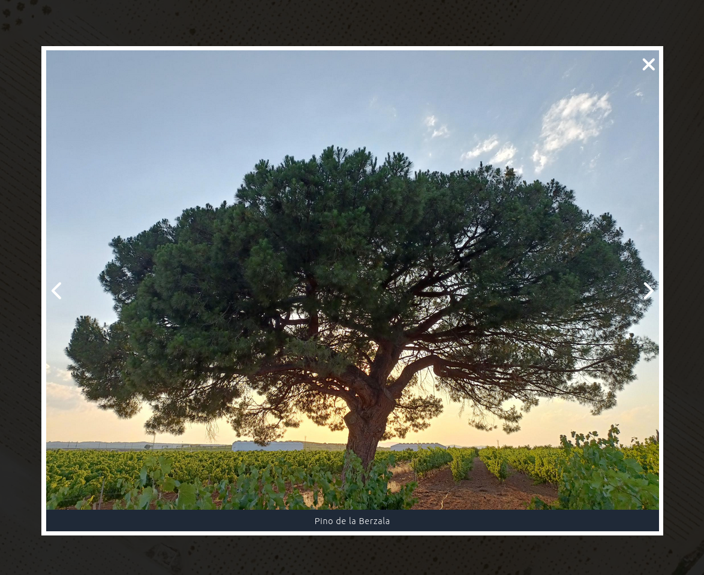

# Photo map

Prueba de concepto en la que se genera una web estática que muestra un mapa interactivo donde se pueden ver algunos lugares y ver fotografías de estos.





## 

```bash
python scripts/convert.py > public/data/data.geojson
```