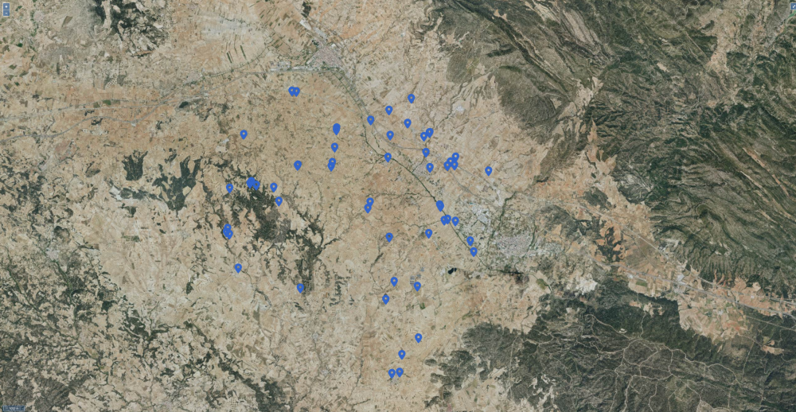

# Photo map

Prueba de concepto en la que se genera una app SPA estática que muestra un mapa interactivo donde se pueden ver diferentes puntos de interés y ver fotografías de estos.

A continuación se muestran algunas capturas de la aplicación.

Vista principal de la aplicación.



Al hacer click en un punto se muestra la información resumida y las miniaturas de las fotografías.


Al hacer click en cualquiera de las fotos es posible ver las imágenes en mayor tamaño.


## Preparar datos

1. Instalar librerías de Python necesarias:

    ```bash
    python -m venv .venv
    source .venv/bin/activate
    pip install -r requirements.txt
    ```

2. Guardar fotografías en el directorio [data/images](data/images/), se recomienda que el nombre tenga el formato `yyyymmddhhMMss.jpg`.

3. Ejecutar script image-processing para generar miniaturas e imágenes para la web. Estas se guardarán en [public/images](public/images/) y [public/thumbnails](public/thumbnails/)

    ```bash
    python scripts/image-processing.py
    ```

4. Preparar fichero GPX con las coordenadas e información de los diferentes puntos de interés (waypoints). El fichero [data/points.gpx.sample](data/points.gpx.sample) contiene un ejemplo de punto de interés. Cada punto puede tener los siguientes campos:
   * **lat**: latitud
   * **lon**: longitud
   * **ele**: altura sobre el nivel del mar
   * **name**: nombre del punto de interés
   * **desc**: descripción del punto de interés
   * **cmt**: comentarios para dispositivos GPS, usamos este campo para añadir los nombres de las imágenes separados por comas
   * **sym**: símbolo, se usa este campo para poner una categorizar los diferentes puntos

5. Ejecutar script para procesar el fichero GPX y generar el fichero GeoJSON usado por la aplicación.

    ```bash
    python scripts/convert.py > public/data/data.geojson
    ```

## Ejecutar en local

1. Instalar dependencias

    ```bash
    npm install
    ```

2. Iniciar app en modo desarrollo

    ```bash
    npm run dev
    ```
